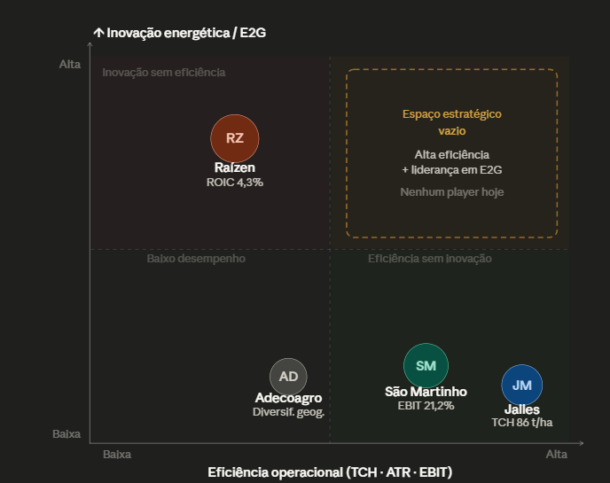

# Matriz de Posicionamento

## Definição dos Eixos

Os eixos escolhidos para a matriz de posicionamento da Raízen são:

- **Eixo X – Eficiência Operacional (Baixa → Alta):** medida pela combinação de TCH
  (Toneladas de Cana por Hectare), ATR (Açúcar Total Recuperável) e EBIT Margin do
  segmento sucroenergético. Captura o quanto cada empresa converte bem seus ativos
  agrícolas e industriais em margem.

- **Eixo Y – Inovação Energética / Aposta em E2G (Baixa → Alta):** medida pelo nível
  de investimento e comprometimento estratégico com etanol de segunda geração,
  bioeletricidade e novos vetores renováveis. Captura o posicionamento de longo prazo
  frente à descarbonização.

**Justificativa da escolha:** Conforme discutido em aula, eixos genéricos como "preço
x qualidade" não revelam vantagens competitivas reais. No setor sucroenergético, as
duas dimensões que mais diferenciam os players são a produtividade agrícola/industrial
(que determina custo e margem no curto prazo) e o grau de inovação energética (que
determina relevância e valuation no longo prazo). A tensão entre eficiência presente e
inovação futura é exatamente o dilema central da Raízen.

---

## Matriz

Jalles Machado e São Martinho estão no canto inferior-direito: são as mais eficientes do setor (TCH 86 e 82, EBIT de quase 20-21%), mas praticamente não investiram em E2G ou inovação energética. São excelentes operadoras do modelo tradicional.
A Raízen está no canto superior-esquerdo: é a única que apostou sério em inovação (pioneira em E2G, R$ 5,7 bi investidos, 770 MWp em renováveis), mas opera com eficiência bem abaixo dos pares — TCH 77, ATR 138,8 e EBIT de apenas 1,7%. Ou seja, ela está pagando o preço da inovação sem ter resolvido a base.
A Adecoagro fica no canto inferior-esquerdo: desempenho intermediário nos dois eixos, sem destaque competitivo claro em nenhuma das dimensões no mercado brasileiro.

---

## Posicionamento das Empresas

**Raízen — Baixa Eficiência Operacional / Alta Inovação Energética**
A Raízen registrou TCH médio de 77 t/ha e ATR de 138,8 kg/t na safra 24/25, abaixo dos
principais pares, com EBIT Margin de apenas 1,7% no segmento sucroenergético. Ao
mesmo tempo, é a única empresa do setor com uma planta E2G em operação comercial
(112 milhões de litros/ano em Piracicaba) e um portfólio de energia renovável de 770 MWp.
O alto investimento em inovação (R$ 5,7 bi em E2G até 24/25) coloca a Raízen no quadrante
de alta inovação, mas a ineficiência agrícola e industrial a mantém no lado esquerdo do eixo X.

**São Martinho — Alta Eficiência Operacional / Baixa Inovação Energética**
Com TCH de 82 t/ha, ATR de 143 kg/t e EBIT Margin de 21,2%, a São Martinho é benchmark
operacional do setor. Seu foco é extrair máximo retorno do modelo sucroenergético
tradicional, sem apostas relevantes em E2G ou novos vetores renováveis. Posiciona-se no
quadrante de alta eficiência e baixa inovação energética.

**Jalles Machado — Alta Eficiência Operacional / Baixa Inovação Energética**
Apresenta o maior TCH do setor (86 t/ha) e EBIT Margin de 19,8%, com modelo de negócio
focado em produtividade agrícola intensiva. Sem exposição relevante a E2G, ocupa o mesmo
quadrante que a São Martinho, competindo via excelência operacional.

**Adecoagro — Eficiência Média / Baixa Inovação Energética**
Opera com eficiência intermediária e foco em diversificação geográfica (Brasil e Argentina),
sem posicionamento diferenciado em inovação energética. Ocupa o quadrante inferior
esquerdo.

---

## Análise

**Existem clusters de empresas?**
Sim. São Martinho e Jalles Machado formam um cluster claro no quadrante de alta eficiência
operacional com baixa inovação energética — ambas competem pelo mesmo espaço de
excelência agrícola e industrial. A Raízen está isolada no quadrante oposto: apostou em
inovação, mas não entregou eficiência operacional.

**Existe espaço pouco explorado?**
O quadrante de **alta eficiência operacional + alta inovação energética** está completamente
vazio. Nenhum player do setor combina hoje produtividade agrícola de referência (TCH acima
de 82 t/ha, ATR acima de 143 kg/t) com escala relevante em E2G ou outras inovações
renováveis. Esse é o espaço estratégico mais valioso do setor no horizonte 2028–2035, à
medida que a pressão por descarbonização e o crescimento do mercado de SAF
(Sustainable Aviation Fuel) se intensificam.

**A Raízen está bem posicionada?**
Não no momento atual. A empresa ocupa uma posição de alta tensão: comprometeu capital
significativo com inovação (E2G, Raízen Power) sem ter resolvido suas ineficiências
operacionais de base. Com ROIC de 4,3% contra WACC estimado de ~14% e dívida bruta
de R$ 57,9 bi, a Raízen não tem folga de capital para ocupar sozinha o espaço vazio. O risco
é que, sem correção operacional urgente, São Martinho ou Jalles — ao avançarem em E2G
após consolidarem margens — ocupem o quadrante ideal antes dela.

---

## Principais Insights

- **Insight 1 — O dilema da Raízen é estratégico, não apenas operacional:** A empresa
  apostou na inovação (E2G) antes de resolver sua base (TCH, ATR, raio de colheita,
  dependência de cana de terceiros). Isso criou um posicionamento de alto risco: cara na
  inovação, fraca na eficiência, pressionada pela dívida. A prioridade imediata deveria ser
  migrar para a direita no eixo X antes de avançar ainda mais no eixo Y.

- **Insight 2 — O espaço vazio é a tese de longo prazo do setor:** A empresa que
  primeiro combinar eficiência operacional de referência (TCH > 82 t/ha) com escala em
  E2G e SAF deterá a maior vantagem competitiva do setor na próxima década. A Raízen
  tem o ativo tecnológico (a planta E2G); precisa da eficiência agrícola para completar o
  quadrante.

- **Insight 3 — A concorrência real da Raízen não é só São Martinho:** Conforme
  discutido em aula, no longo prazo a Raízen compete com eletricidade, fontes renováveis
  alternativas e veículos elétricos. Isso torna o posicionamento no eixo Y (inovação
  energética) ainda mais crítico — não como diferencial frente a pares do setor, mas como
  condição de relevância futura frente a substitutos do etanol.

---

## Fontes

- Raízen S.A. – Relatório de Relações com Investidores (raizen.com.br/ri). Acesso: abr/2026
- São Martinho S.A. – Relatório de RI, safra 24/25
- Jalles Machado S.A. – Relatório de RI, safra 24/25
- Adecoagro S.A. – Relatório de RI, safra 24/25
- UNICA – Dados setoriais de produtividade (TCH e ATR), safra 2024/25
- Desterro, Marcelo. *Trilha de Negócios – AgrotechT28, IN 02: Estratégia Competitiva no
  Agronegócio*. Inteli, 28 abr. 2026
- B3 – Cotações históricas RAIZ3/RAIZ4